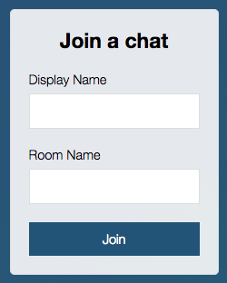
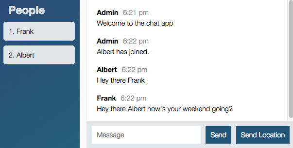

# node-chat
Node Chat app with Socket IO

* Clone the project 
* run `npm install`
* run `node server/server.js`

Join rooms by going to localhost:3000!

### Sample images

##### Login Window:

##### Messaging Window:

